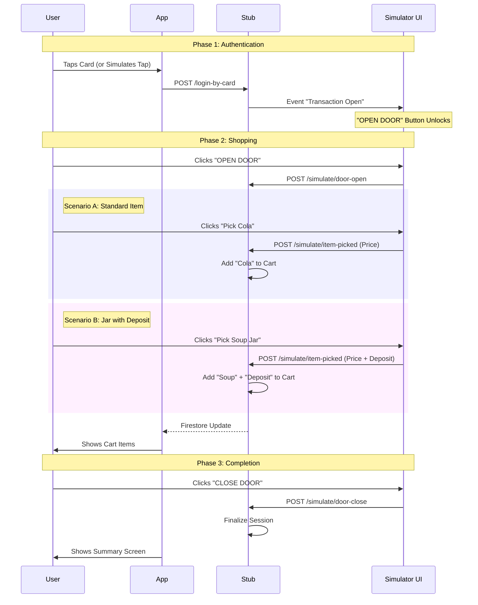
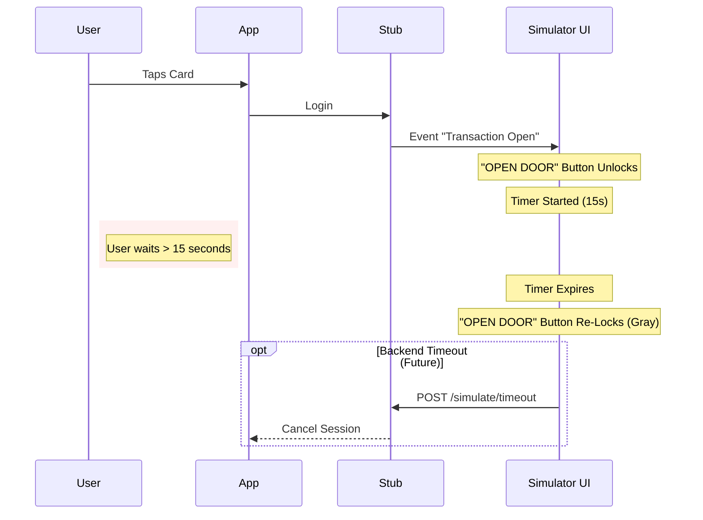
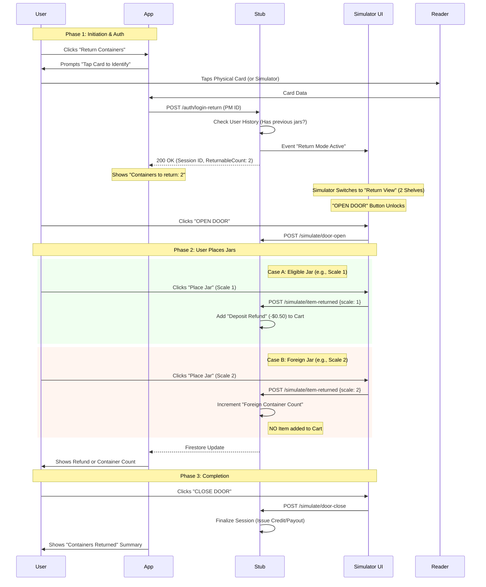
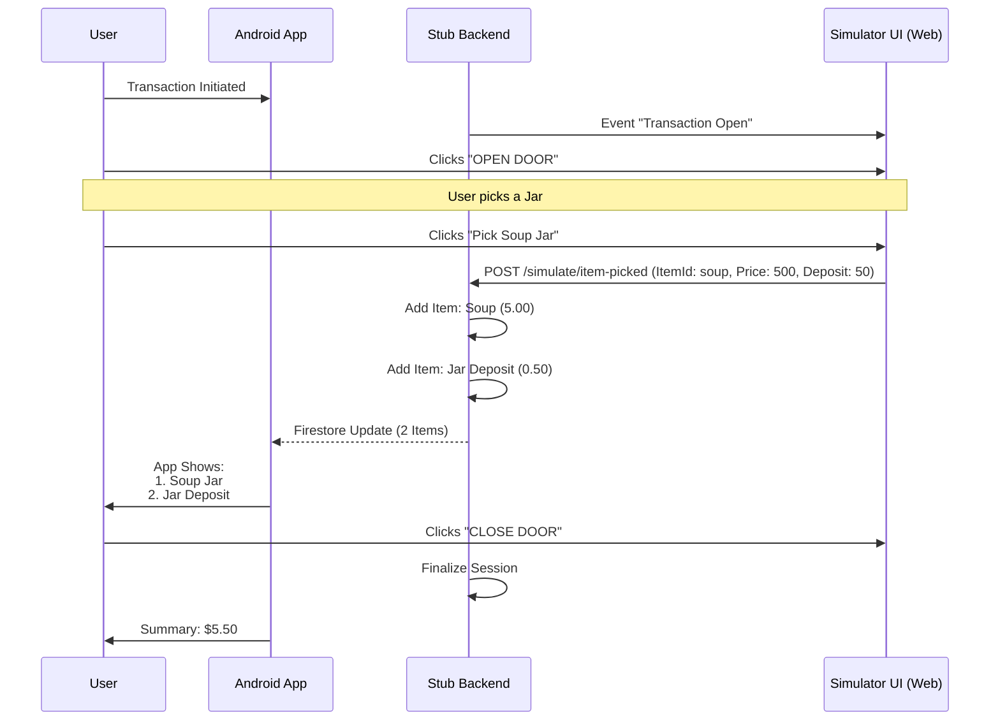

# Sequence Diagrams: Venloop Tap to Pay Flow

## 1. Flow: Standard Purchase (Virtual or Real)

This flow covers users buying items (Standard or Jars with Deposit).
Auth provided via Emulator (Simulate Tap) or Real Device (NFC Tap).

## 2. Flow: Timeout Sequence (No Action)

This flow occurs if the user taps their card but walks away or fails to open the door within 15 seconds.

## 3. Flow: Return Containers (Deposit Return)

This flow allows users to return used jars. The backend verifies if they have "eligibility" (previously purchased jars) to determine if they get a cash refund or just a "Foreign Container" count.

## 2. Deposit Flow: Jar Purchase

